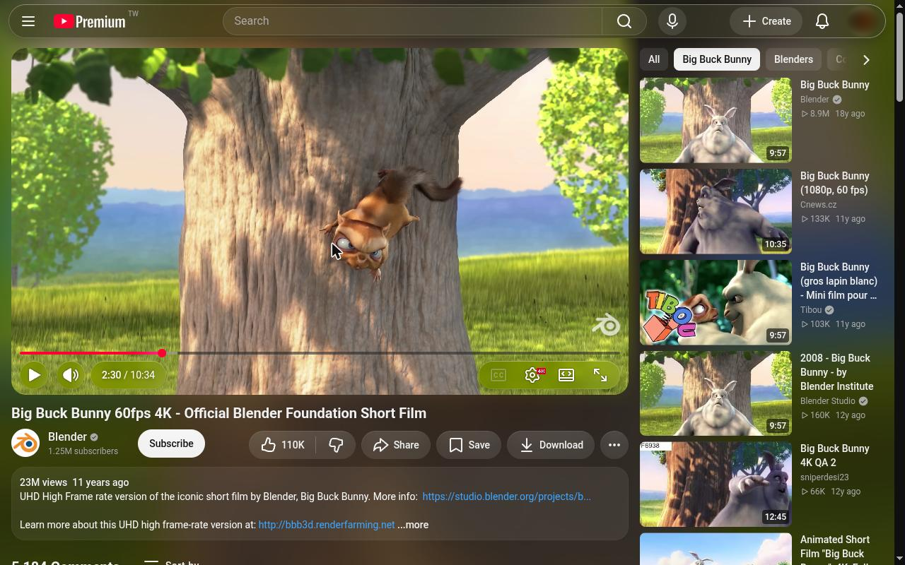
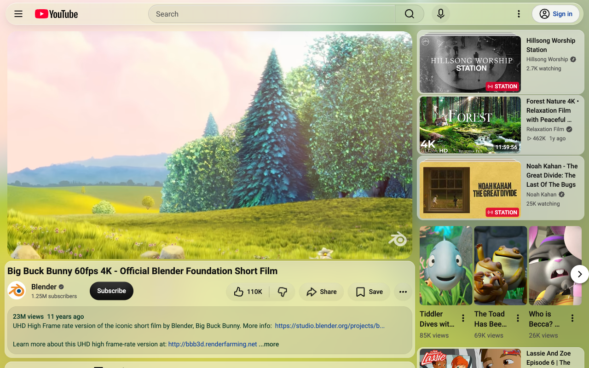
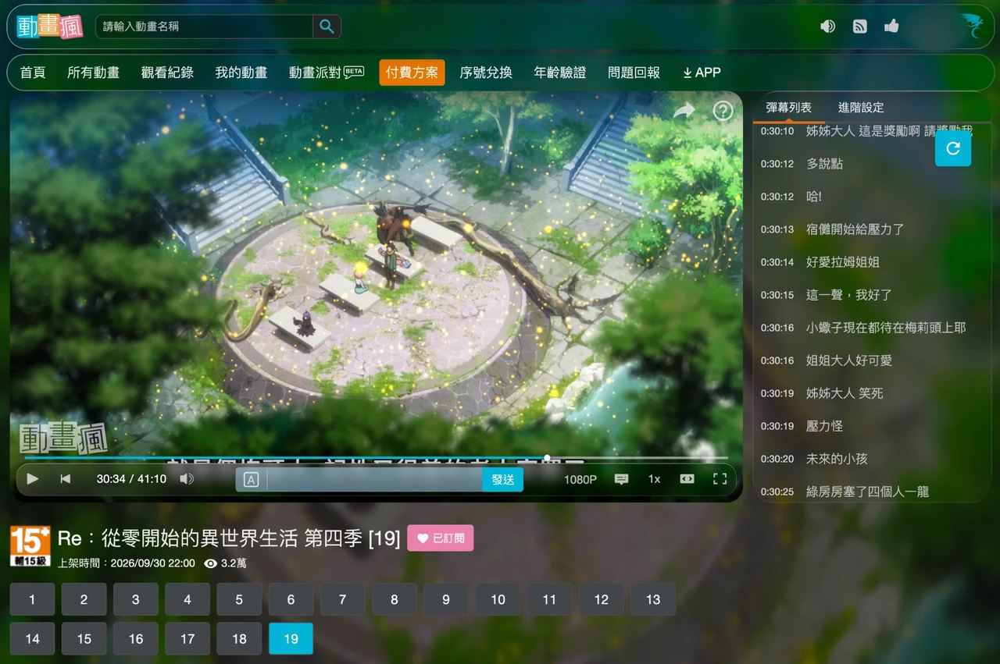
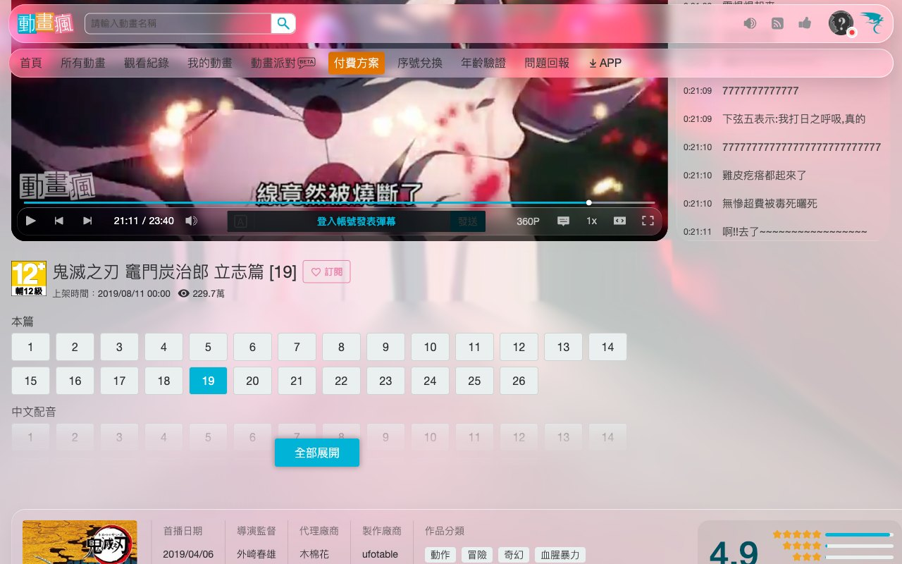
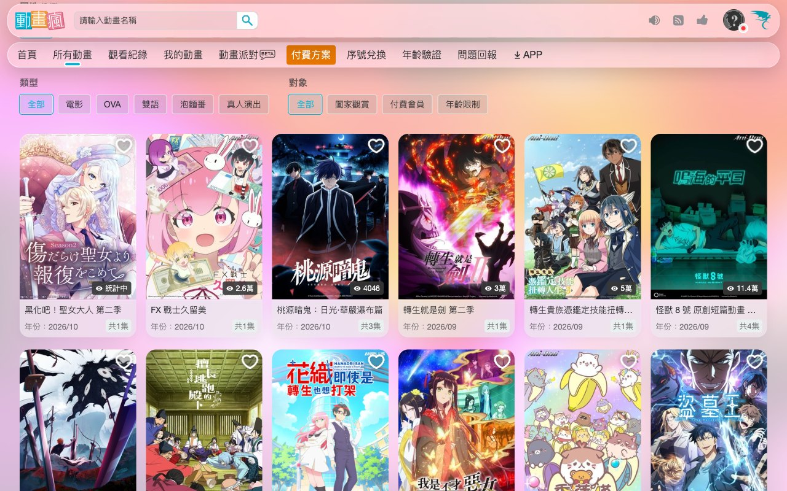
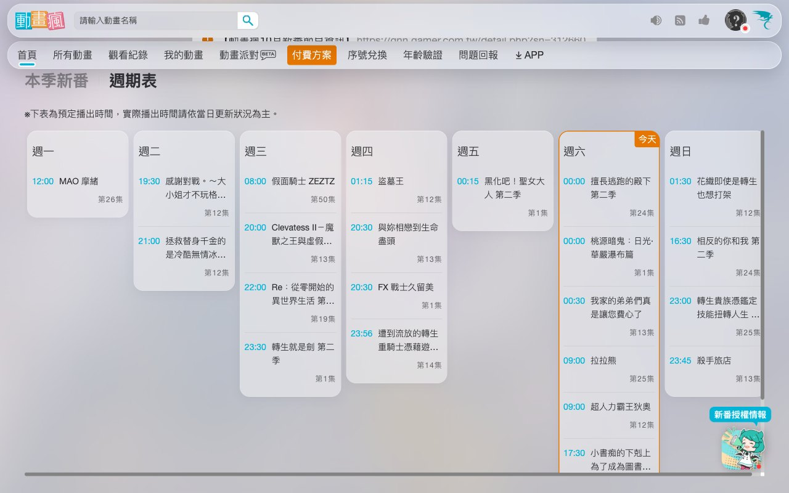

# Glasslight

Chromium extension (MV3) that gives video sites — YouTube™ and 巴哈姆特動畫瘋
(ani.gamer.com.tw) — a frosted, refractive glass
interface — inspired by the glass design language Apple presented at WWDC25 —
with page-wide ambient light driven by the playing video, while keeping text
legible.

> Glasslight is an independent project. It is not affiliated with, endorsed
> by, or sponsored by Apple Inc., Google LLC, YouTube, or Bahamut (巴哈姆特).
> Site names are used only to say where the extension works.

## Screenshots

**YouTube**

<table>
<tr>
<td width="50%"></td>
<td width="50%"></td>
</tr>
<tr>
<td>Watch page, dark theme: the playing video lights the page; glass masthead and Clear glass player controls.</td>
<td>Light theme: the same light, with text kept at the contrast target.</td>
</tr>
</table>

**巴哈姆特動畫瘋**

<table>
<tr>
<td width="50%"></td>
<td width="50%"></td>
</tr>
<tr>
<td>Watch page: light from the episode, floating glass bars, the player as a rounded card, glass danmu column.</td>
<td>Transparency 100 (strongest light, least frost): cards and panels turn into Clear glass over the footage.</td>
</tr>
<tr>
<td width="50%"></td>
<td width="50%"></td>
</tr>
<tr>
<td>Anime list: glass cards; with nothing playing, the hovered or centred cover lights the page.</td>
<td>Schedule (週期表): every day column is a glass card, today keeps its orange outline.</td>
</tr>
</table>

Site content shown in the screenshots belongs to its respective owners.

## Supported sites

- `www.youtube.com` — watch pages, theater mode, Shorts, channels, search,
  playlists, live chat and the miniplayer.
- `ani.gamer.com.tw` (巴哈姆特動畫瘋) — watch page, home, anime list, search and
  watch history: ambient light from the playing episode (on browse pages, from
  the hovered or centred anime cover), floating glass top bars, glass menus,
  cards and panels, the player as a rounded card with a Clear glass control
  bar (edge to edge in theater mode, with the header out of the way), all on
  the same settings. Entry point `src/content/ani-gamer.js`,
  styles `src/styles/ani-gamer.css`.

## What it does

| Layer (WWDC25 guidance) | YouTube | 動畫瘋 | Treatment |
|---|---|---|---|
| Background | whole page | whole page | `#lg-ambient`: the playing picture as one of three Backdrop modes (popup) — Hybrid (default): enlarged behind the player, with radial light from the frame's edges past it; Enlarged: the frame enlarged over the viewport; Radial: the picture's edges streamed outward from the player (Hybrid and Radial need WebGL, else Enlarged) — or the hovered / centred thumbnail or cover blurred over it, plus a glow behind the player |
| Content | videos, description, comments, panels | info panel, comments, danmu column, anime / episode / news / history cards, schedule | YouTube: no glass — fills and transparency. 動畫瘋: one card glass for every card (a dense panel up to the Transparency midpoint, Clear glass past it) |
| Navigation | masthead, chip bar, menus, drawer | top bar, main menu, user menu, search suggestions, sort and APP menus | Regular glass: frost + refraction + specular rim + adaptive shadow |
| Over media | player controls, Shorts actions | player control bar | Clear glass, 35% dimming layer over bright footage |

**Transparency.** One slider spans the material. At 50 % (default) it is the
designed look: Regular glass over a colour wash of the video. Towards 0 the
glass thickens (denser tint, heavier frost). Towards 100 it becomes the
Clear variant and the backdrop
turns from a wash into the footage itself (sharper, larger canvas, less
blur), laid out by the Backdrop mode: in Hybrid the picture enlarged behind
the player, then light streaming from its edges to the edges of the page,
so the light is continuous with the video while the glass lenses it. Burned-in
subtitles stay inside the player: the light is taken only from the frame's
outer band, and right under the player it starts at the player's edge. Neither end stops being glass: the tint stays
between 0.12 and 0.88, light keeps spilling in, and the rim brightens as the
tint thins. Frost thins with it, down to a quarter of the Blur setting at
100 % (2–6 px, glass rather than frosted glass); menus, and glass over
content scrolling underneath, keep the full frost. At 100 % the backdrop is
a 768×432 canvas with 1 px blur, so the footage behind the glass is sharp. On 動畫瘋 the cards follow the
same axis: dense panels for running text up to 50 %, then Clear glass down to
the same tint floor, so at 100 % the footage reads through them too. Reduce
Transparency pins it at 50 %; Reduce Motion keeps the backdrop a wash.

**Legibility.** Text is never made translucent. Whenever the light changes
(up to every 250 ms while a video plays) `ambient.js` solves a *scrim map*: for each cell of a 16×9 grid, `contrast.js` finds the
smallest scrim alpha that keeps the worst sampled pixel there at the target
WCAG contrast (default 4.5:1) against the weakest text colour, with 5 %
headroom (10 % for sharp immersive footage); the map is dilated by a cell and stretched smoothly over the page.
Dark water stays vivid, only bright shoals are dimmed. The masthead's glass
tint is solved the same way over what is really behind it (ambient → scrim
map → player glow). Secondary text is raised (vibrancy) so the light can stay
brighter at equal contrast, including YouTube's hashed design tokens, which
are found by value in its stylesheets, and its link blue (deepened on light
pages, lifted on dark ones); on 動畫瘋 the same applies to the site's
cyan accents and light-grey labels, which are lifted or deepened per theme.

## Languages

Traditional Chinese, Simplified Chinese, English, Spanish, Japanese and
Korean (`_locales/`). By default the popup follows the browser language
(English as fallback); a Language menu in the popup overrides it. The
extension's name and store description always follow the browser language —
Chrome offers no way to change those at runtime.

## Install

Download
[glasslight-1.1.2.zip](https://github.com/Vik1n9/glasslight/releases/latest/download/glasslight-1.1.2.zip)
from [Releases](https://github.com/Vik1n9/glasslight/releases). Unzip it so the
folder contains `manifest.json`, then `chrome://extensions` → Developer mode →
**Load unpacked** → that folder. Chromium 116 or newer; Edge and Brave use the
same steps. The packaged file is the one to install — the release's "Source
code" archive is the repository, including the development reloader.

## Install (development)

1. `chrome://extensions` → Developer mode → **Load unpacked** → this folder.
2. Unpacked installs auto-reload: edit any file and the extension and open
   YouTube / 動畫瘋 tabs reload within ~2 s (`src/content/dev-reload.js`).

## Release build

`python3 scripts/build.py` → `dist/glasslight-<version>.zip`, ready for the
Chrome Web Store. It drops the dev auto-reload and checks that every file the
manifest references exists, locales share one key set, and descriptions fit
Chrome's 132-character limit. Store texts, privacy answers and assets live in
`store/` (`store/listing.md`); the privacy policy is [PRIVACY.md](PRIVACY.md).

## Layout

```
src/content/settings.js   shared namespace + chrome.storage.sync settings
src/content/contrast.js   WCAG luminance/contrast, scrim solver, dominant colour
src/content/refract.js    SVG displacement maps (SDF of a rounded rect) as backdrop-filter
src/content/ambient.js    video → canvas light (enlarged frame + radial edge light), glow, scrim map, letterbox/DRM detection
src/content/thumbs.js     thumbnail / cover colour for browse pages (YouTube via the service
                          worker; site adapters' CORS image hosts read directly)
src/content/main.js       YouTube: routing (yt-navigate-finish), decoration, pointer highlight
src/content/ani-gamer.js  動畫瘋 adapter: LG.site selectors, settings, decoration
src/styles/glass.css      shared visual rules, scoped to html.lg-on
src/styles/ani-gamer.css  動畫瘋 layer, scoped to html.lg-ani
src/background.js         thumbnail fetch/downsample, dev reload
src/popup/                settings UI
```

## Notes

- Chromium drops CSS filter functions after a `url()` in `backdrop-filter`,
  so refracting surfaces do blur → displace → saturate inside the SVG filter.
- Performance: live values that change every 250 ms are never written to
  `<html>` (an inherited custom property there restyles all of YouTube, and a
  layout read after it forces that synchronously, ~50 ms). Light-layer values
  sit on `#lg-ambient`; glass tint lives in one rule matching only glass
  elements. Frame analysis scales on a GPU canvas before any CPU readback.
- Idle (nothing playing): the light is only read back from the GPU after it
  changes, the backdrop's slow drift holds still until playback resumes, and
  動畫瘋's endlessly looping attention cues stop after three rounds — an idle
  page costs about what it does without the extension.
- Refraction is Chromium-only; with it off (or in performance mode) glass
  falls back to `blur() saturate()`.
- Honours `prefers-reduced-transparency`, `prefers-contrast: more`,
  `prefers-reduced-motion`, plus in-popup Reduce Transparency / Performance.

## Credits

- [WesselKroos/youtube-ambilight](https://github.com/WesselKroos/youtube-ambilight) (MIT) —
  frame scheduling with `requestVideoFrameCallback`, letterbox detection, hidden-tab pausing.
- [g6vz6mj4fr-oss/-glass-youtube](https://github.com/g6vz6mj4fr-oss/-glass-youtube) (MIT) —
  YouTube selectors; real blur only on a few surfaces for performance.
- [theysap/GlassTube](https://github.com/theysap/GlassTube) (MIT) — Reduce Transparency option.
- [kube.io — Liquid Glass in the Browser](https://kube.io/blog/liquid-glass-css-svg/) and
  [sven1577/liquid-glass](https://github.com/sven1577/liquid-glass) — SVG displacement refraction.
- Apple's WWDC25 session "Meet Liquid Glass" — design reference for layering, variants,
  dimming and accessibility; no Apple assets are used.

## License

MIT — see [LICENSE](LICENSE).

## Trademarks

YouTube, Chrome and Chromium are trademarks of Google LLC. 巴哈姆特 (Bahamut)
and 動畫瘋 (Anime Crazy) are trademarks of their respective owner. Apple is a
trademark of Apple Inc., and "Liquid Glass" is Apple's name for its design
material. These names are used only to describe compatibility and design
references; this project is not affiliated with or endorsed by any of these
companies, and all site content shown through the extension remains the
property of its owners. The icon and all code are original to this project.
